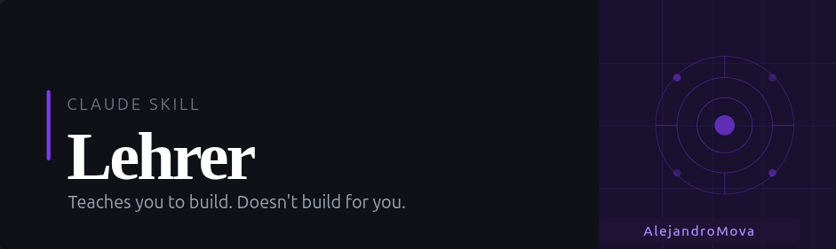

[](https://github.com/AlejandroMova/Lehrer)

[](https://github.com/AlejandroMova/Lehrer/releases/latest)

# Lehrer

> A Claude skill that guides you through understanding and building features in large codebases — without writing the code for you.

---

## What it does

Entering a large codebase is disorienting. Whether you inherited it, vibe-coded it, or just haven't touched it in months — if you can't reason about it, you can't safely extend or debug it.

Lehrer (*German: teacher*) acts as a senior developer sitting next to you. When you want to add a feature or fix a bug, it doesn't write the code — it maps the terrain, explains the tools, recommends an approach, and reviews what you build afterward.

**The goal is that you finish understanding, not just finished.**

---

## What it does NOT do

Lehrer never writes implementation code. No functions, no classes, no logic blocks. It uses pseudocode and structure sketches to explain concepts, but the runnable code is always yours.

This is intentional. A codebase built on code you don't understand is a liability. Lehrer's job is to make sure that doesn't happen.

---

## Four phases

**1. Feature Map**
Walk through what the feature or fix actually requires: which components are involved, how data flows, where to hook in, and what could break.

**2. Library Context**
For every non-trivial library or API the feature touches: what it does, the key abstractions, the common patterns, and the gotchas.

**3. Implementation Recommendations**
A numbered, step-by-step plan you can execute yourself. Includes what to avoid, edge cases to design for upfront, and how to verify your work.

**4. Review**
After you implement it, Lehrer reviews what you built — checking for correctness, integration fit, and understanding gaps, with specific feedback and a pointer to what to learn next.

---

## When to use it

- Adding a feature to a codebase you didn't fully write
- Fixing a bug you don't yet understand
- Entering a large or unfamiliar system and needing orientation before touching anything
- Any time you want to build something yourself but need a map first

---

## Installation

### Claude.ai

1. Download `lehrer.skill` from the [latest release](https://github.com/AlejandroMova/Lehrer/releases/latest)
2. Go to **Settings → Skills**
3. Click **Install from file** and select `lehrer.skill`

### Claude Code (terminal)

```bash
mkdir -p ~/.claude/skills/lehrer
curl -L https://github.com/AlejandroMova/Lehrer/releases/latest/download/lehrer.skill -o /tmp/lehrer.skill
unzip /tmp/lehrer.skill -d ~/.claude/skills/lehrer
```

Restart Claude Code — the skill is available immediately.

### Updating
 
```bash
mkdir -p ~/.claude/skills/
unzip -o /tmp/lehrer.skill -d ~/.claude/skills/
```
 
The skill reloads automatically on the next conversation — no restart needed.
 

---


## Example interaction

**User:** I need to add license plate recognition to my DeepStream pipeline. Walk me through it.

**Lehrer (Phase 1 — Map):**
1. LPR is a secondary inference task — it runs after the primary detector identifies vehicles
2. You'll need a second `nvinfer` element (SGIE) configured with an LPR model
3. The data flow: primary detector → tracker (assigns IDs) → LPR SGIE (runs on cropped vehicle ROIs) → probe callback (reads plate text from metadata)
4. The integration point: insert the SGIE element after your tracker in the pipeline builder
5. Blast radius: anything downstream that reads NvDsObjectMeta will now see new attributes on vehicle objects

**Lehrer (Phase 2 — Libraries):**
- `nvinfer`: DeepStream's inference plugin. For SGIEs, key properties are `config-file-path`, `operate-on-gie-id` (which PGIE's output to act on), and `operate-on-class-ids` (which detected classes to run on)...

**Lehrer (Phase 3 — Plan):**
1. Get or train an LPR model and export it to TensorRT engine format
2. Write the SGIE config file — set `operate-on-class-ids=2` (vehicle class) and point to your engine
3. In your pipeline builder, create a new `nvinfer` element and insert it after the tracker...

*(After implementation)*

**Lehrer (Phase 4 — Review):**
🟡 IMPROVE — `operate-on-gie-id` not set
Where: `sgie_lpr.cfg`
Why it matters: without this, the SGIE will run on all detected objects, not just those from your PGIE...

---

## Project structure

```
lehrer/
├── SKILL.md                  # The skill instructions
├── README.md                 # This file
├── examples/
│   ├── feature/              # Worked four-phase feature walkthroughs
│   └── bug/                  # Worked bug investigation walkthroughs
└── references/
    ├── systems.md            # Patterns for common system types
    └── debugging.md          # Systematic debugging approaches by bug category
```

---

## Philosophy

> "The goal is that you finish understanding, not just finished."

Lehrer is built on the belief that developers who understand their systems are faster, not slower. The short-term cost of building mental models compounds into long-term speed, debuggability, and ownership.

Inspired by *A Mind for Numbers* (Oakley) and *The Pragmatic Programmer* (Hunt & Thomas). The core insight: the most dangerous codebase isn't a messy one — it's one you can't reason about.

---

## Related skills

- **[Humanly](https://github.com/AlejandroMova/Humanly)** — transforms AI-generated or messy code into clean, human-readable code. Use Humanly *after* Lehrer: Lehrer helps you build it right, Humanly helps you make it readable.

---

Built with [Claude](https://claude.ai) · MIT License
